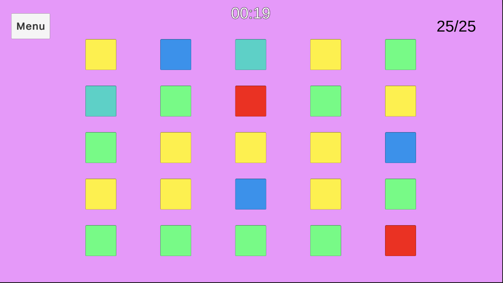

# Board Game

Template di un gioco da tavolo. Per vincere il giocatore deve distruggere tutte le caselle prima della fine del tempo.

A seconda del colore, un quadrato ha più o meno punti vita.

## Screenshot

